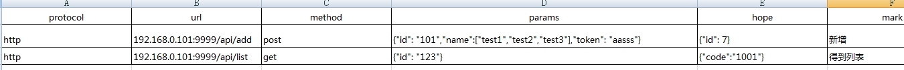
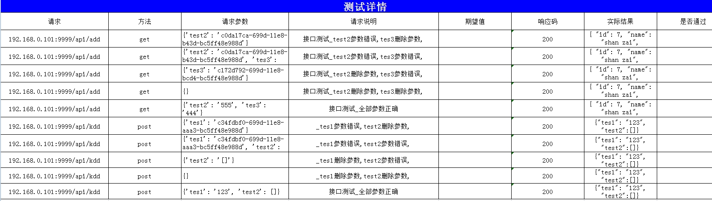
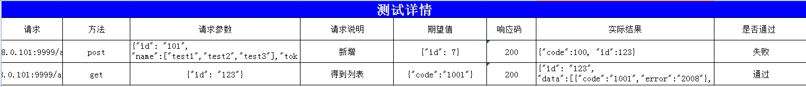

# 项目简介
基于python3的自动化接口测试

## 功能
* Win7 64，python 3，Pycharm. unittest
* excel管理用例
* 邮件发送测试结果
* 基于pict模糊测试

## 用法
### 不使用模糊测试
* 首先电脑需要配置python3.4的环境
* 点击lib目录下的install.bat安装依赖文件
* 维护Report目录下的api.xlsx写入接口测试
* 点击Runner.py的start.bat,或者python runner.py
* 查看测试报告Report目录下的report.xlsx
### 使用模糊测试
* 点击lib目录下的install_pict.bat进行依赖文件安装,会自动关闭explorer
* 打开Setting目录下的Config.ini设置为True
* 模糊测试现在只支持对每个参数的错误，删除的场景，可以自行扩展
* 模糊测试暂不支持检查点

## 报告

## 其他

* [使用说明](mark.md)
