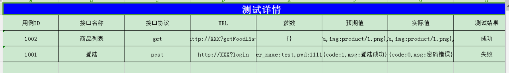

#项目名及简介
基于python3的自动化接口测试框架

# 功能
* Win7 64，python 3，Pycharm. unittest
* xml管理用例
* 邮件发送测试结果

# 用法
* Runner_m.py 核心代码。run_case是程序的入口
* 配置xml

```
<root>
    <title>接口测试</title>
    <host>ddd.XX.com</host>
    <port>80</port>
    <No>[1001]</No> #  不填，就是运行下面所有用例
    <header>{"Accept":"text/html,application/xhtml+xml,application/xml;q=0.9,*/*;q=0.8","User-Agent":"Mozilla/5.0 (Windows NT 6.1; rv:29.0) Gecko/20100101 Firefox/29.0"}</header>
    <InterfaceList>
        <params>
            <name type="str">account</name>
            <value>1361212121</value>
            <must>1</must>
        </params>
        <params>
            <name type="str">password</name>
            <value>222222</value>
            <must>1</must>
        </params>
         <params>
            <name type="int">type</name>
            <value>0</value>
            <must>1</must>
        </params>
        <isList>0</isList>
        <id>1001</id>
        <name>登陆</name>
        <method>POST</method>
        <url>Login</url>
        <hope>{"appStatus":{"errorCode":0,"message":"操作...</hope>
        <login>user_id</login> # 登陆后需要返回的信息给其他接口调用，比如userid,token等
        <isList>0</isList>
    </InterfaceList>
    <InterfaceList>
      <params>
            <name type="int">lookerId</name>
            <value>2</value>
            <must>1</must>
        </params>
        <id>1002</id>
        <name>个人主页</name>
        <method>GET</method>
        <url>GetPersonalHomePage1</url>
        <hope>{"appStatus":{"errorCode":0,"message":"操作成功"},"content":[{"business_name":"坤达点子","notice_img":"\/product\/20160718184134_321.jpg","user_type":1,"user_id":2,"goods":[{"good_price":45211.0,"good_id":12,"good_name":"艾欧","banner_picture1":"\/product\/20160719165135_8977.png"},{"good_price":199.0,"good_id":14,"good_name":"麒麟瓜1","banner_picture1":"\/product\/20160720102028_5352.jpg"},{"good_price":452.0,"good_id":6,"good_name":"实力产品","banner_picture1":"\/product\/20160718165448_2602.png"},{"good_price":99898.0,"good_id":11,"good_name":"越南芒果","banner_picture1":"\/product\/20160720100057_5877.jpg"}],"shop_img":"\/product\/20160718120144_3196.jpg","head_picture":"http:\/\/dgm.boweixin.com\/\/product\/20160718134528_4744.jpg","notice_id":1}]}</hope>
         <login>1</login> # 需要登陆后的参数
        <isList>1</isList> # 有嵌套层
    </InterfaceList>
</root>


注意这里,如果想验证这里的值的类型或者非必填参数，预期值注意变化
  <params>
            <name type="str">account</name> # type=str表示字符类型
            <value>18576759587</value>
            <must>1</must> # 1表示必填，0非必填
        </params>

```

## 关于检查点

有嵌套层。检查机制是，检查第一层的code,第二层list的key是否相等，list的value的值的type是否相等

# 使用报告




# 其他

* 更多信息查看我的[更新日志](channel_log.md)
* 之前写的[接口用例生成器](https://github.com/284772894/SaveXML)生产xml
